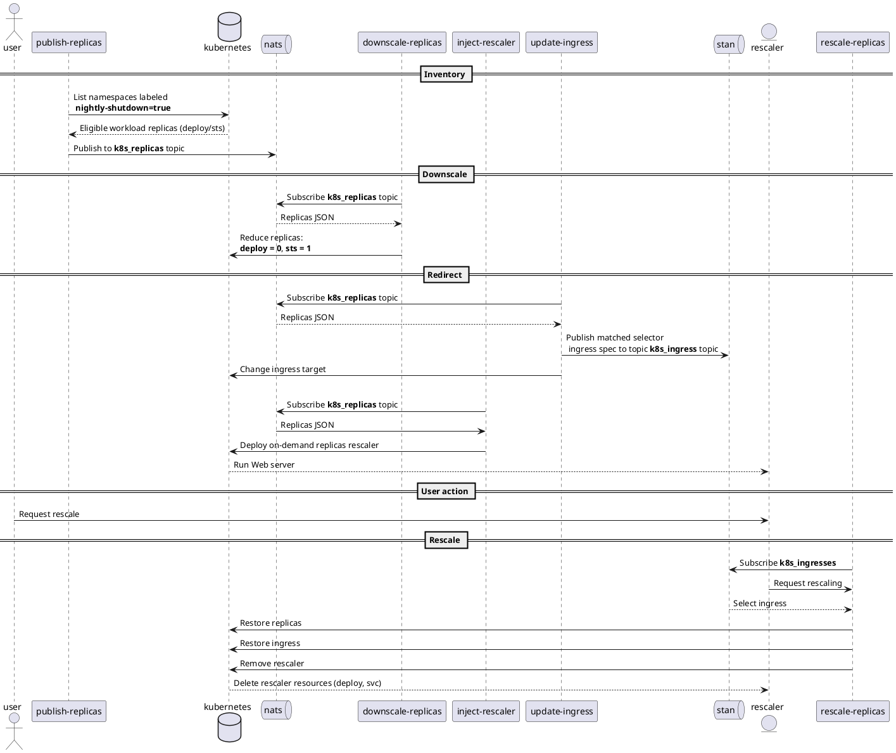

# Nozzle

Reduce Kubernetes resources on a metrics and scheduled decision basis.

## Kubeless

Serverless implementation based on Python3, Kubeless and NATS.

## OpenFaaS

Serverless implementation based on Python3, Kubeless and NATS.

## Golang

Native Kubernetes implementation based on a Custom Controller written and Go `1.13.x`.
