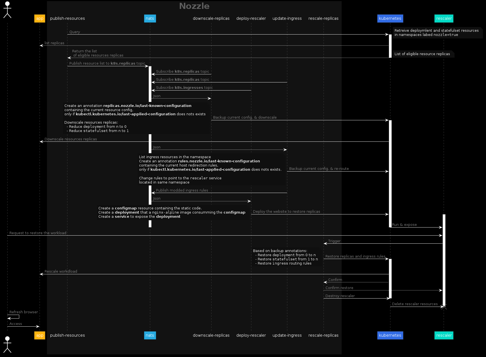

# Nozzle

Reduce Kubernetes workload on schedule or traffic decision basis and restore workload on-demand via Web UI or http trigger.

## Introduction

This project has been initially created during the [Sustainable Digital Challenge](https://www.apidays.co/sustainable-digital-challenge) event organized by [APIdays](https://www.apidays.co) to demonstrate the vision of an aggressive compute resource saving strategy.

> Do you keep the lights on, once you left the room ?

This simple sentense resumes the resoning on how over estimating [availability](https://uptime.is) leads to uncouscious a wast of natural resources.

Nozzle promotes sustainability by simply shuting down eligible resources like:

- **Non-production** environments managed by developer
- **Application services** required to run only on working hours

### How it works

Nozzle has been initially designed to run as function inside Kubernetes.
The following sequence diagram describe the steps that functions acheive to securely reduce and restore the workload managed by this orchestrator.

### Design requirements

The project has been design using the following requirements to ensure the product sustainability.

* [x] Store only when required
* [x] Search for reuse before creating something new
* [x] Aims for the least footprint
* [x] Constrain the volume of data transfer and resource allocation
* [x] Limit the usage of Javascript frameworks
* [x] Scale-to-zero when possible
* [x] Compliance with the [12 Factor](https://12factor.net)

### Implementations roadmap

<table>
  <tr align='center'>
    <th align='center'>Serverless</th>
    <td align='center'></td>
    <td align='center'><a ref='https://kubeless.io'>Kubeless<a></td>
    <td align='center'>stable</td>
  </tr>
  <tr align='center'>
    <th align='center'>Serverless</th>
    <td align='center'></td>
    <td align='center'><a ref='https://openfaas.com'>OpenFaaS<a></td>
    <td align='center'>stable</td>
  </tr>
  <tr align='center'>
    <th align='center'>Serverless</th>
    <td align='center'></td>
    <td align='center'><a ref='https://fission.io'>Fission<a></td>
    <td align='center'>alpha</td>
  </tr>
  <tr align='center'>
    <th align='center'>Binary</th>
    <td align='center'></td>
    <td align='center'><a ref='https://golang.org'>Golang<a></td>
    <td align='center'>not started</td>
  </tr>
</table>

### Screenshots

The follwing screeshots show the Nozzle impact on the [microservices-demo](https://microservices-demo.github.io) from [Weaveworks](https://www.weave.works), which by default supports 14 microservices.

User gets the following reactive landing page after noozle downscaled the application.

Once clicked on the **rescale** button, the user gets the logs related to the rescaling of the workload associated to its application.

> From a **storage efficiency** point-of-view Noozle restores the application from Kubernetes resource [annotations](https://kubernetes.io/docs/concepts/overview/working-with-objects/annotations/).
> By defualt the last known Kubernetes resources configuration is backed up inside the native `kubectl.kubernetes.io/last-applied-configuration` annotation.
> If not present, Nozzle generates its own annotation containing the minimal amount of date.
> The following annotation are generated depending on the resource type:
> * **Deployment & Statefulset**: `replicas.nozzle.io/last-known-configuration`
> * **Ingress**: `rules.nozzle.io/last-known-configuration`

Resource consumption after user request to rescale.

User have to refresh it brower tab to regain access to its application

This last picture shows the resource consumtion after noozle downscaled the application and deployed the rescaler.

## Message formats

* **Replicas JSON**: `{"namespace": str, "name": str, "kind": str, "replicas": int, "selector": { dict }}`
* **Ingress JSON**: `{"namespace": str, "name": str, "rules": { dict }}`
