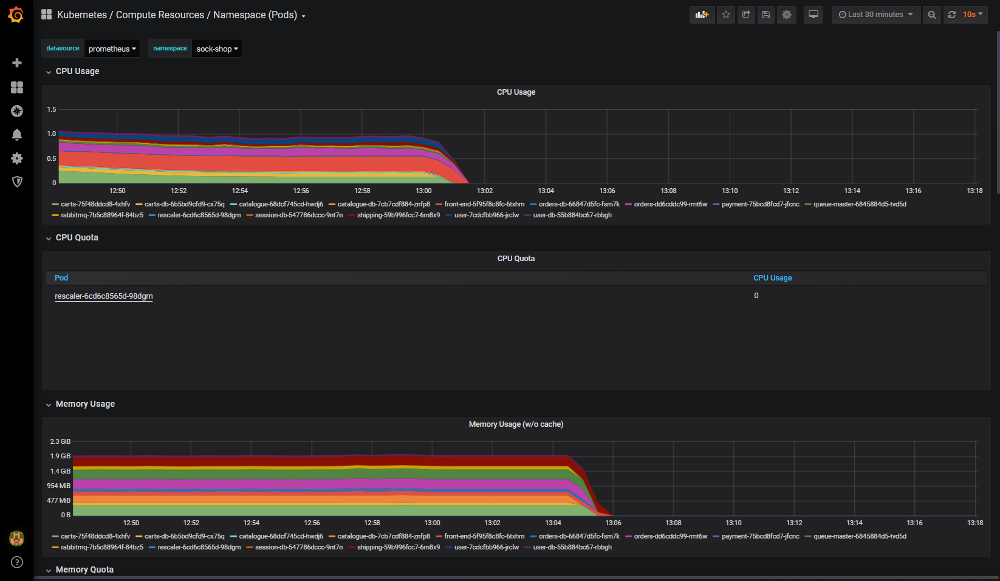

# Nozzle

Reduce Kubernetes workload on scheduled or traffic decision basis and restore workload on-demand via Web UI or http trigger.

### Screeshots

## Backup efficiency

The last-known Kubernetes resources configuration is backed up as [annotations](https://kubernetes.io/docs/concepts/overview/working-with-objects/annotations/), **only** if the native `kubectl.kubernetes.io/last-applied-configuration`  is not present.

Following additional annotations are implement depending on the ressource type:

* **Deployment & Statefulset**: `replicas.noozle.io/last-known-configuration`
* **Ingress**: `rules.noozle.io/last-known-configuration`

**Warning** : Ingress resources are modified to redirect the traffic to the `rescaler` pod

## Message formats

* **Replicas JSON**: `{"namespace": str, "name": str, "kind": str, "replicas": int, "selector": { dict }}`
* **Ingress JSON**: `{"namespace": str, "name": str, "rules": { dict }}`

## Implementations

### Kubeless

Serverless implementation based on Python3, Kubeless and NATS.

### OpenFaaS

Serverless implementation based on Python3, OpenFaaS and NATS.

### Dapr

Serverless implementation based on Python3, Dapr and NATS.

### Golang

Native Kubernetes implementation based on a Custom Controller written and Go `1.13.x`.
