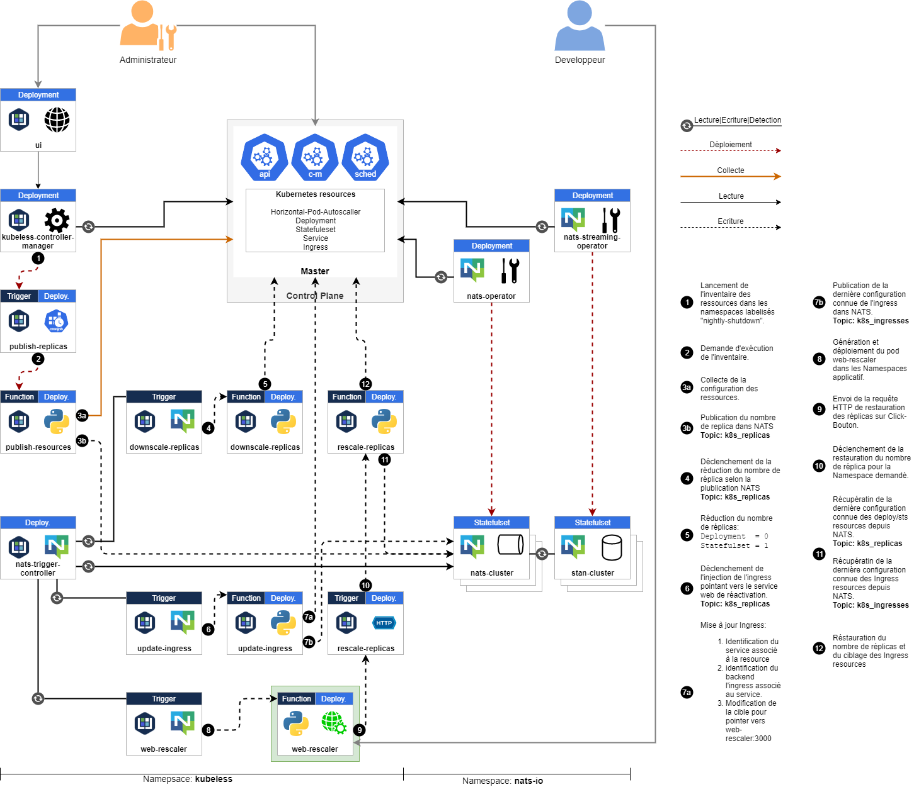

# Kubernetes list replica on given namespace label selector

List all deployments and statefulsets replicas of namespaces containing the label `nozzle=true`.
Return a message containing number replica of both resources.



## List replicas

Expose the NATS cluster locally.

```bash
kubectl -n nats-io port-forward nats-cluster:4222
```

Create a namespace and create the deployment and the statefulset for testing purposes

```bash
kubectl create namespace demo

kubectl label namespace demo nozzle=true
kubectl -n demo apply -f manifests/deployment.yaml
kubectl -n demo apply -f manifests/statefulset.yaml
```

Execute the following command to list the replicas of `Deployment` and `StatefulSet` resources.

```bash
NATS_ADDRESS=localhost:4222

python3 list-replicabynamespacelabelselector.py
```

```text
...
2020-01-15 15:00:31,035 - script - INFO - Namespace: demo Deployment: web Replica: 3
2020-01-15 15:00:31,067 - script - INFO - Namespace: demo StatefulSet: web Replica: 3
```

## Publish number of replica to NATS periodically

Kubeless `cronjob` function is leveraged to publish amount of replica of Deployment and Statefulset resources on a scheduled basis.

Execute the following command to create a `function` that publish the amount of replica of Namespaces labeled `nozzle=true`.

> It is required to change the service account to get appropriate RBAC permssions on the Kubernetes API.
> But Kubeless does not support ServiceAccount in Functions currently
> It is then required to patch the generated resource. 

```bash
kubeless function deploy publish-resources --namespace kubeless --runtime python3.6 --handler publish-resources.run --from-file functions/publish-resources.py --dependencies functions/publish-requirements.txt --env NATS_ADDRESS='nats://nats-cluster.nats-io:4222' && \
kubectl apply -n kubeless -f manifests/kubeless-replica-view-rbac.yaml && \
kubectl -n kubeless patch deployment publish-resources -p '{"spec":{"template":{"spec":{"serviceAccountName":"kubeless-replica-view"}}}}'
```

Execute the following command to create a `trigger` that run the `function` every 5 minutes.

```bash
kubeless trigger cronjob create pubk8sreplica --namespace kubeless --function publish-resources --schedule '*/5 * * * *'
```

## Scale down the number of replica on NAT publish event

Execute the following command to deploy the function that captures publish events to the Nats queue in order to reduce the number of replicas.

```bash
kubeless function deploy downscale-resources --namespace kubeless --runtime python3.6 --handler downscale-resources.run --from-file functions/downscale-resources.py --dependencies functions/downscale-requirements.txt && \
kubectl apply -n kubeless -f manifests/kubeless-replica-manage-rbac.yaml && \
kubectl -n kubeless patch deployment downscale-resources -p '{"spec":{"template":{"spec":{"serviceAccountName":"kubeless-replica-manage"}}}}'
```

Execute the following command to create a `trigger` that run the `function` on NATS events.

```bash
kubeless trigger nats create downscale-resources  --namespace kubeless --function-selector created-by=kubeless,function=downscale-resources --trigger-topic k8s_replicas
```


## Patch Ingress based on Deployment/Statefulset selectors

To indentify the Ingress resource to patch, Template labels pushed for each Deployment and Statefulset are used to identify the associated service.
Then service name is used to identify which Ingress has the Service name as backend.

If an Ingress resource matches the criteria, a patch modifying the backend `serviceName` and `servicePort` is applied to it.

Execute the following command to deploy the function to patch the eligible Ingress resources.

```bash
kubeless function deploy update-ingress --namespace kubeless --runtime python3.6 --handler update-ingress.patch --from-file functions/update-ingress.py --dependencies functions/publish-requirements.txt --env NATS_ADDRESS='nats://nats-cluster.nats-io:4222' && \
kubectl apply -n kubeless -f manifests/kubeless-ingress-manage-rbac.yaml && \
kubectl -n kubeless patch deployment update-ingress -p '{"spec":{"template":{"spec":{"serviceAccountName":"kubeless-ingress-manage"}}}}'
```

Execute the following command to create a `trigger` that run the `function` on NATS events.

```bash
kubeless trigger nats create update-ingress  --namespace kubeless --function-selector created-by=kubeless,function=update-ingress --trigger-topic k8s_replicas
```

## Deploy Web Rescaler pod

A webserver pod is deployed in downscaled Namespaces to provide website to restore the initial number of replica.

Execute the follwing command line to deploy the function that handle the `web-rescaler` pod on events publish on the `k8s_ingresses` NAT topic.

```bash
kubeless function deploy web-rescaler --namespace kubeless --runtime python3.6 --handler web-rescaler.create --from-file functions/web-rescaler.py --dependencies functions/web-requirements.txt && \
kubectl apply -n kubeless -f manifests/kubeless-ingress-manage-rbac.yaml && \
kubectl -n kubeless patch deployment web-rescaler -p '{"spec":{"template":{"spec":{"serviceAccountName":"kubeless-deployment-manage"}}}}'
```

```bash
kubeless trigger nats create web-rescaler --namespace kubeless --function-selector created-by=kubeless,function=web-rescaler --trigger-topic k8s_ingresses
```

Execute the following command to create a `trigger` that run the `function` on NATS events.

## Test environment

Scripts are validated on the using the following environment.

* [Kubernetes](https://github.com/kubernetes/kubernetes): `v1.16.3`
* [Nats operator](https://github.com/nats-io/nats-operator): `v0.6.0`
* [Nats cluster](https://github.com/nats-io/nats-server): `v2.1.2`
* [Kubefwd](https://github.com/txn2/kubefwd): `1.11.1`

## References

* **Kubernetes CoreV1Api** : <https://github.com/kubernetes-client/python/blob/master/kubernetes/docs/CoreV1Api.md#list_namespace>
* **Kubernetes AppsV1Api** : <https://github.com/kubernetes-client/python/blob/master/kubernetes/docs/AppsV1Api.md#list_namespaced_deployment>
* **Crontab Generator**: <https://crontab-generator.org>
* **Python running task concurently**: <https://docs.python.org/3/library/asyncio-task.html#running-tasks-concurrently>
