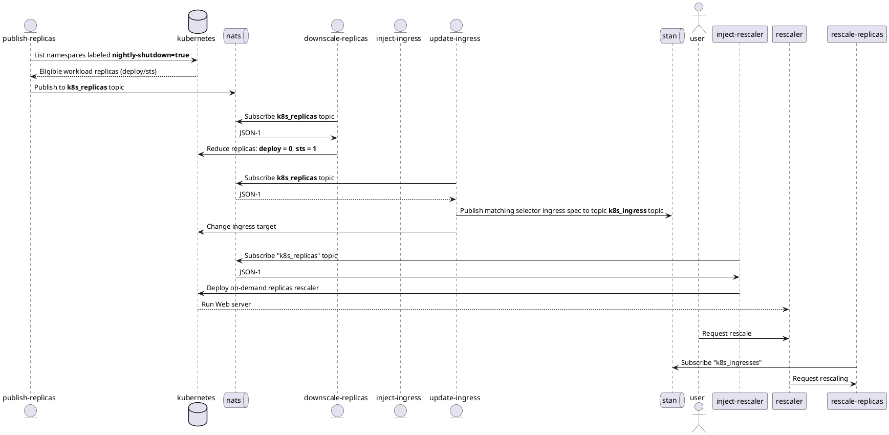

# Nozzle

This document show you how to deploy Nozzle in a Kubernetes cluster running the OpenFaaS serverless platform.

Serverless is a particular Kind of microservices architecture that splits services into ephemeral functions to enhance observability and cost efficiency.
Serverless platforms are orchestration tools to efficiently run the code when it is required. To acheive this they support a set of trigger to react on events like HTTP requests, scheduled jobs, message queue publishing, etc.



* **JSON-1**: `{"namespace": str, "name": str, "kind": str, "selector": {dict}}`


## Pre-requesits

OpenFaaS requires you you to install Docker or a Continous Integration platform to build Docker images that will be used to execute functions.
This repository contains CI example based on:

* [Travis CI](https://travis-ci.org)

You need to get a copy of this repository to run the commands:

```bash
git clone https://github.com/fjudith/noozle

cd noozle/openfaas
```

## Noozle Stack deployment

This topic covers the build, release and deployment of the Nozzle functions inside the Kubernetes cluster.

> Not required if you run a Continuous Integration

The OpenFaaS Command Line Client `faas-cli` needs to be installed.
Instructions to install it on your PC are documented [here](https://docs.openfaas.com/cli/install/)

Run the following command to:

* Deploy the `demo` environment includic 3 webserver replicas in the form of `StatefulSet`and `Deployment`
* Deploy the appropriate RBAC for functions in the `openfaas-fn` namespace
* Build the functions container images, push them to docker hub registry and publish the functions in the Kubernetes cluster via the Openfass Gateway.

```bash
# Deploy appropriate RBAC and demo environment
kubectl apply -f manifests/

# Build | Release | Deploy
# Equivalent to:
# faas-cli build -f stack.yml -o dev && \
# faas-cli push -f stack.yml && \
# faas-cli deploy -f stack.yml "

faas-cli up stack.yml -o dev
```
